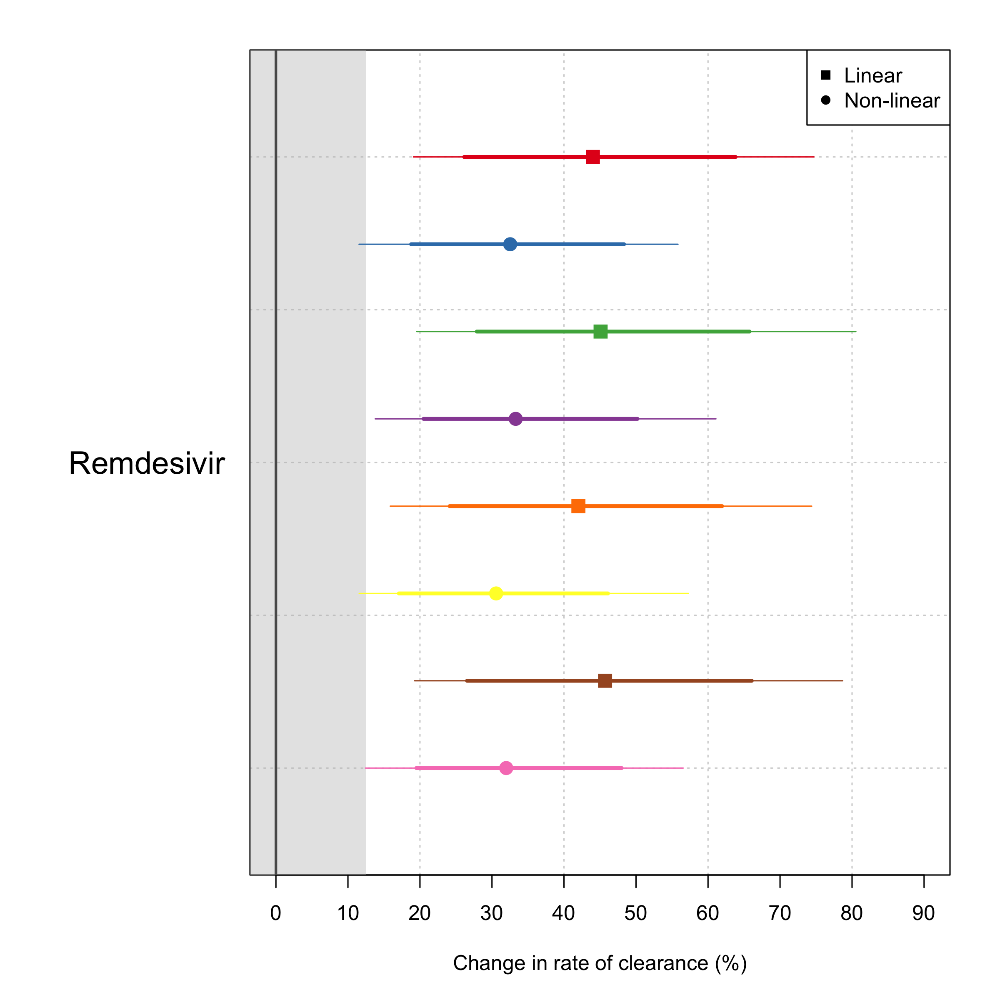
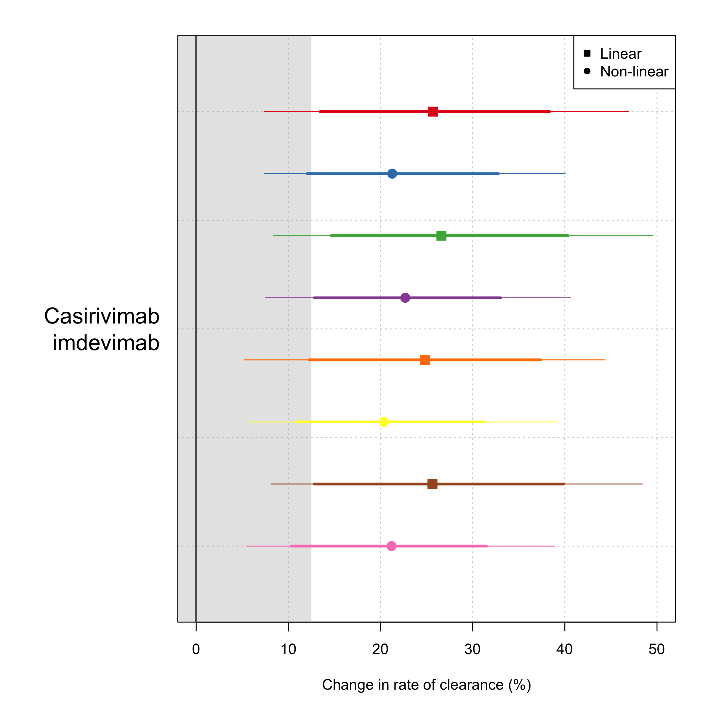
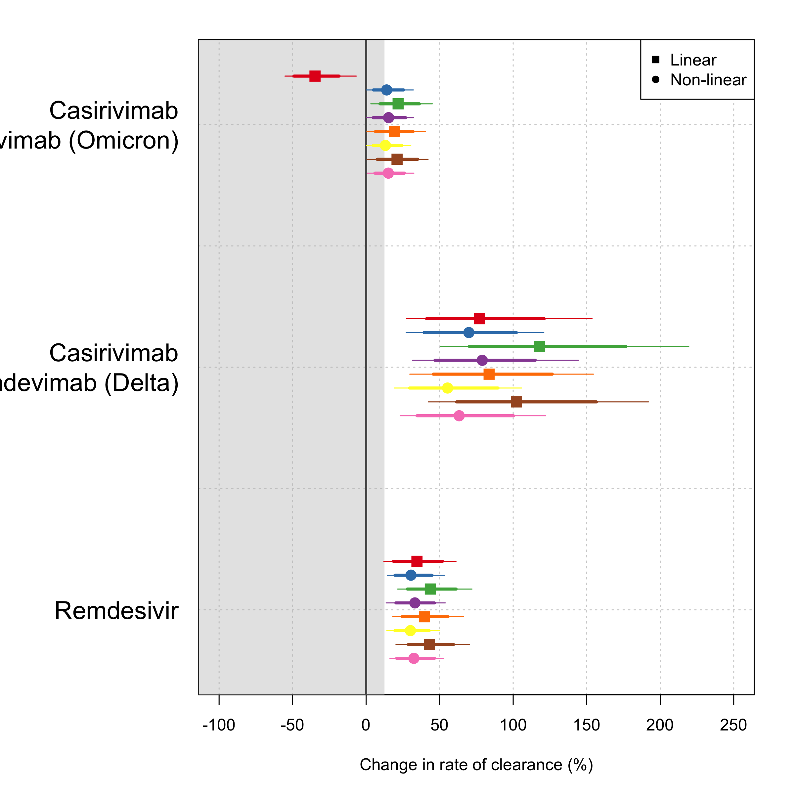
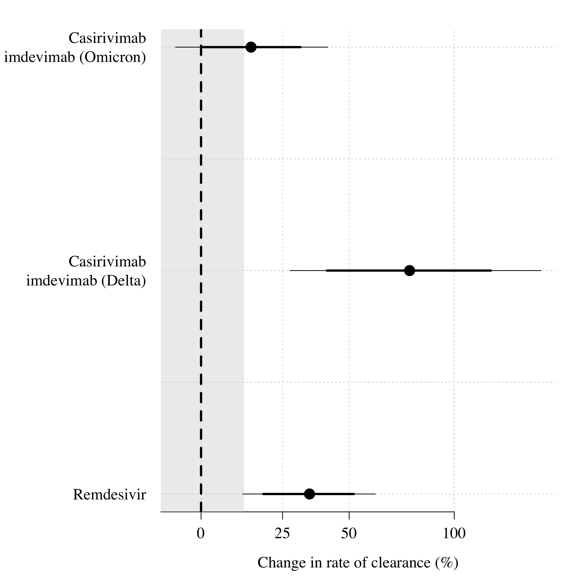
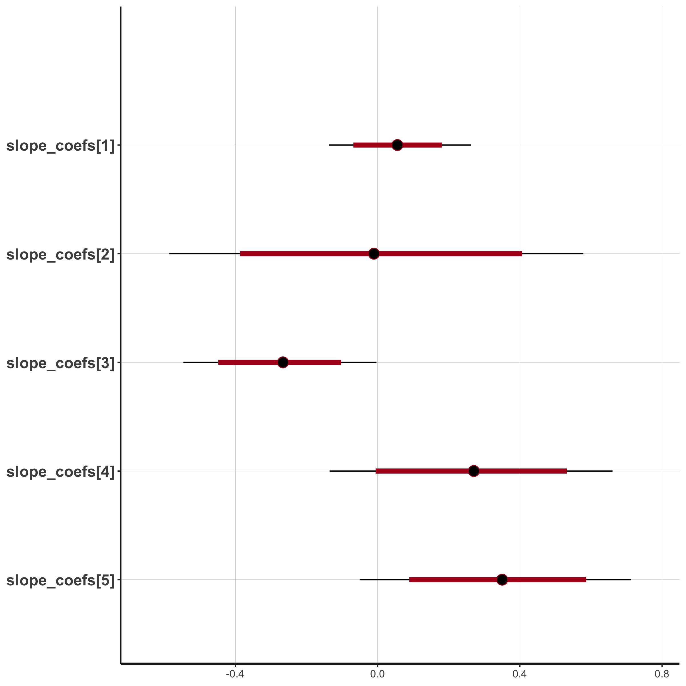
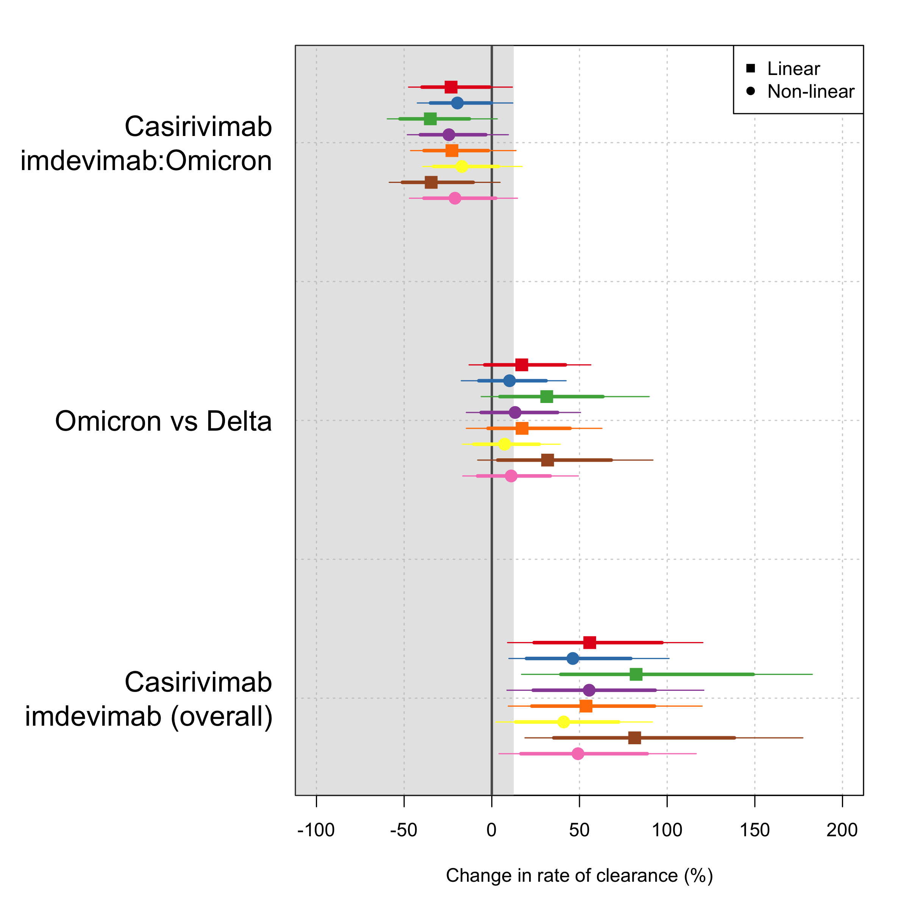
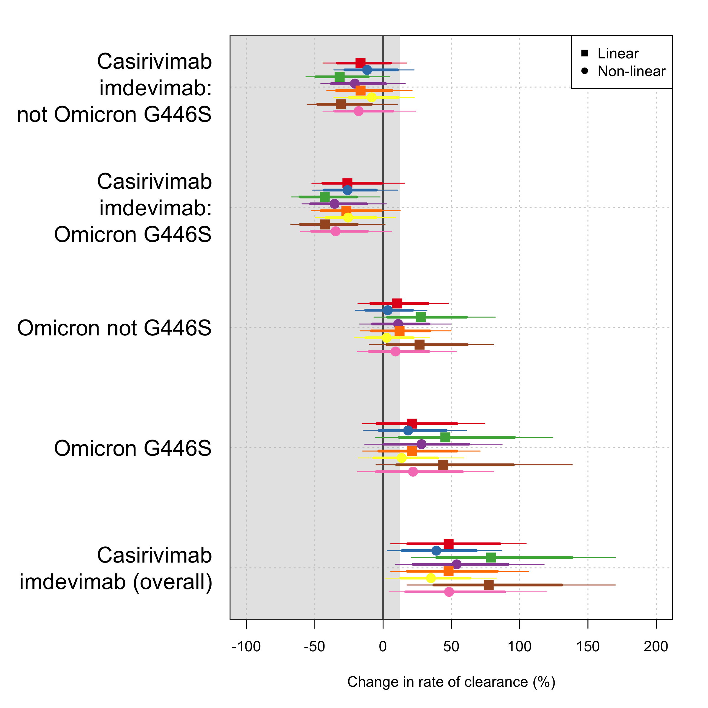

# Preamble

This Statistical Analysis Plan (SAP) is written for the PLATCOV trial (registered at ClinicalTrials.gov: <https://clinicaltrials.gov/ct2/show/NCT05041907>).

Data preparation is done in a different R script called data_prep.R. This Markdown script assumes that the data are saved in a .csv file *interim_dat.csv* in long format. The file *interim_dat.csv* contains the patient clinical and viral load data with the following column headers:

-   ID: anonymized patient id code
-   Time: time from randomization
-   Trt: treatment allocation as written in CRF
-   Site: site at enrollment
-   Timepoint_ID: Day of study (integer 0 to 14)
-   BARCODE: unique sample id code (in the following format: PLT-site-number-swab type-timepoint)
-   Swab_ID: RTS or TSL (right versus left tonsil)
-   Plate: unique Plate ID for the PCR assay (matching with plate identifiers in interim_control_dat.csv)
-   Rand_date: date of randomization
-   Any_dose: (0/1) any doses of any manufacturer received
-   N_dose: integer number of doses received (any manufacturer)
-   Antibody_test: 0/1 (negative/positive for SARS-CoV-2 antibody rapid test)
-   Weight (kg)
-   BMI: kg/weight\^2
-   Age: (years - has to be between 18-50)
-   Sex: 0/1 (male: 1; female/other: 0)
-   Symptom_onset: time since onset of symptoms (days)
-   Variant: variant of concern (using standard WHO terminology for the main lineages, reference will be the predominant variant in the data set at the start of the study)
-   CT_NS: observed CT value for the N/S gene
-   CT_RNaseP: observed CT value for the human RNase P gene
-   Per_protocol_sample: whether at the time of sampling the patient was still in per protocol with respect to drug dosing
-   IgG: + IgG band on the LFT
-   IgM: + IgM band on the LFT
-   log10_viral_load: log10 number of viral copies per mL (estimated from control samples using a mixed effects model)
-   log10_cens_vl: censoring value

## Computational setup


```
##                _                           
## platform       x86_64-apple-darwin17.0     
## arch           x86_64                      
## os             darwin17.0                  
## system         x86_64, darwin17.0          
## status                                     
## major          4                           
## minor          0.2                         
## year           2020                        
## month          06                          
## day            22                          
## svn rev        78730                       
## language       R                           
## version.string R version 4.0.2 (2020-06-22)
## nickname       Taking Off Again
```

```
## R version 4.0.2 (2020-06-22)
## Platform: x86_64-apple-darwin17.0 (64-bit)
## Running under: macOS  10.16
## 
## Matrix products: default
## BLAS:   /Library/Frameworks/R.framework/Versions/4.0/Resources/lib/libRblas.dylib
## LAPACK: /Library/Frameworks/R.framework/Versions/4.0/Resources/lib/libRlapack.dylib
## 
## locale:
## [1] en_GB.UTF-8/en_GB.UTF-8/en_GB.UTF-8/C/en_GB.UTF-8/en_GB.UTF-8
## 
## attached base packages:
## [1] stats     graphics  grDevices utils     datasets  methods   base     
## 
## other attached packages:
## [1] brms_2.17.0          Rcpp_1.0.9           plotrix_3.8-2       
## [4] reshape2_1.4.4       RColorBrewer_1.1-2   loo_2.4.1           
## [7] rstan_2.21.2         ggplot2_3.3.5        StanHeaders_2.21.0-7
## 
## loaded via a namespace (and not attached):
##   [1] nlme_3.1-153         matrixStats_0.61.0   xts_0.12.1          
##   [4] threejs_0.3.3        tensorA_0.36.2       tools_4.0.2         
##   [7] backports_1.2.1      bslib_0.3.0          DT_0.19             
##  [10] utf8_1.2.2           R6_2.5.1             DBI_1.1.1           
##  [13] colorspace_2.0-2     withr_2.5.0          tidyselect_1.1.1    
##  [16] gridExtra_2.3        prettyunits_1.1.1    processx_3.7.0      
##  [19] Brobdingnag_1.2-7    emmeans_1.6.3        curl_4.3.2          
##  [22] compiler_4.0.2       cli_3.3.0            shinyjs_2.0.0       
##  [25] sandwich_3.0-1       colourpicker_1.1.0   posterior_1.2.2     
##  [28] sass_0.4.0           scales_1.1.1         dygraphs_1.1.1.6    
##  [31] checkmate_2.0.0      mvtnorm_1.1-2        ggridges_0.5.3      
##  [34] callr_3.7.2          stringr_1.4.0        digest_0.6.29       
##  [37] rmarkdown_2.11       base64enc_0.1-3      pkgconfig_2.0.3     
##  [40] htmltools_0.5.2      fastmap_1.1.0        htmlwidgets_1.5.4   
##  [43] rlang_1.0.4          rstudioapi_0.13      shiny_1.6.0         
##  [46] jquerylib_0.1.4      farver_2.1.0         generics_0.1.0      
##  [49] zoo_1.8-9            jsonlite_1.8.0       gtools_3.9.2        
##  [52] crosstalk_1.1.1      dplyr_1.0.7          distributional_0.3.0
##  [55] inline_0.3.19        magrittr_2.0.3       bayesplot_1.8.1     
##  [58] Matrix_1.3-4         munsell_0.5.0        fansi_1.0.3         
##  [61] abind_1.4-5          lifecycle_1.0.1      multcomp_1.4-17     
##  [64] stringi_1.7.4        yaml_2.2.1           MASS_7.3-54         
##  [67] pkgbuild_1.2.0       plyr_1.8.6           grid_4.0.2          
##  [70] parallel_4.0.2       promises_1.2.0.1     crayon_1.5.1        
##  [73] miniUI_0.1.1.1       lattice_0.20-44      splines_4.0.2       
##  [76] knitr_1.34           ps_1.7.1             pillar_1.8.1        
##  [79] igraph_1.2.6         estimability_1.3     markdown_1.1        
##  [82] shinystan_2.5.0      codetools_0.2-18     stats4_4.0.2        
##  [85] rstantools_2.1.1     glue_1.6.2           evaluate_0.16       
##  [88] V8_3.4.2             RcppParallel_5.1.4   vctrs_0.4.1         
##  [91] httpuv_1.6.3         gtable_0.3.0         purrr_0.3.4         
##  [94] assertthat_0.2.1     xfun_0.26            mime_0.11           
##  [97] xtable_1.8-4         coda_0.19-4          later_1.3.0         
## [100] survival_3.2-13      rsconnect_0.8.24     tibble_3.1.8        
## [103] shinythemes_1.2.0    TH.data_1.0-10       ellipsis_0.3.2      
## [106] bridgesampling_1.1-2
```

# Overview of data
## Load data


```
## All negative samples for id: PLT-TH1-128
```

```
## PCR database contains data from 236 patients
```

```
## we are missing patient PLT-TH1-056
## we are missing patient PLT-BR3-031
```

```
## 
##              Favipiravir               Fluoxetine               Ivermectin 
##                       95                       39                       46 
##             Molnupiravir Nirmatrelvir + Ritonavir             Nitazoxanide 
##                       23                       20                        8 
##            No study drug                Regeneron               Remdesivir 
##                       97                       74                       67
```

## Data summaries

number of patients by analysis


```
## In the remdesivir analysis there are 131 patients (64 controls and 67 remdesivir)
```

```
## In the regeneron analysis there are 158 patients (84 controls and 74 remdesivir)
```


Display the per protocol matrix


```
## Number of patients per arm in modified intention to treat analysis
```

```
##                Include_mITT
##                 FALSE TRUE
##   No study drug     4   91
##   Regeneron         0   74
##   Remdesivir        0   67
```

```
## Number of swabs per protocol per treatment
```

```
##                PP_swabs
##                  4  6 18 20
##   No study drug  1  2  0 92
##   Regeneron      0  0  1 73
##   Remdesivir     0  0  0 67
```


```
## In the mITT dataset we have 4638 PCR datapoints on 232 patients from 4 sites between 2021-10-02 and 2022-08-24:
```

```
## N patients in mITT pop by site:
```

```
## 
## br003 th001 th057 th058 
##    16   203     6     7
```

```
##                
##                 BA.1 BA.2 BA.4 BA.5 Delta
##   No study drug   13   48    1   19    10
##   Regeneron       15   30    0   16    13
##   Remdesivir      20   37    0    0    10
```

```
##                
##                 Delta Omicron
##   No study drug    10      81
##   Regeneron        13      61
##   Remdesivir       10      57
```

```
##                
##                 Delta Omicron_G446S Omicron_notG446S
##   No study drug    10            13               68
##   Regeneron        13            15               46
##   Remdesivir       10            20               37
```

```
## [1] TRUE
```

```
## In the 232 patients, the geometric mean baseline (defined as samples taken within 6 hours of randomisation) viral load was 333936 copies per mL (95 percentile interval from 1736 to 64220513; range from 460 to 79656305)
```


<!-- -->


Summary table


```
## [1] "Casirivimab\nimdevimab" "Remdesivir"             "No study drug"
```

```
## female is 59%
```

```
## median age is 28 (IQR: 24-34)
```

```
## median time since symptom onset is 2 (IQR: 2-3)
```

```
## At least 1 vaccine is 97%
```

```
##     25%     50%     75% 
##   59020  374491 2664346
```

```
## Censored values up until day 7:
```

```
## 
## left none 
##  584 3588
```

```
## The proportion censored is 14%
```

```
## Variants in mITT database:
```

```
## 
##  BA.1  BA.2  BA.4  BA.5 Delta 
##    48   115     1    35    33
```

```
## Variants in mITT database by treatment:
```

```
##                         
##                          BA.1 BA.2 BA.4 BA.5 Delta
##   Casirivimab\nimdevimab   15   30    0   16    13
##   No study drug            13   48    1   19    10
##   Remdesivir               20   37    0    0    10
```


Table: Summary of patient characteristics included in the current interim analysis (n= 232). Age: median (range); baseline viral load (log10 copies per mL: mean (range)); vaccinated: % with any number of doses; number of vaccine doses: median (range); antibody data are from rapid tests done at screening (+ is presence of IgM or IgG band).

|Arm                   |  n|Age        |Baseline viral load (log10) |Number of vaccine doses | Antibody+ (%)| Male (%)| th001| th058| th057| br003|
|:---------------------|--:|:----------|:---------------------------|:-----------------------|-------------:|--------:|-----:|-----:|-----:|-----:|
|Casirivimab
imdevimab | 74|26 (18-48) |5.7 (3-7.8)                 |3 (0-5)                 |            88|       36|    70|     3|     1|     0|
|No study drug         | 91|29 (18-50) |5.5 (3-7.9)                 |3 (0-5)                 |            96|       38|    79|     2|     3|     7|
|Remdesivir            | 67|28 (19-49) |5.5 (2.7-7.4)               |3 (0-4)                 |            90|       48|    54|     2|     2|     9|

## Summary data plot

This includes all patients in the mITT population with the per protocol swabs.

<!-- -->

```
## Plotting data for 131 individuals
```

```
## Plotting data for 158 individuals
```

```
## Plotting data for 23 individuals
```

```
## Plotting data for 26 individuals
```

```
## Plotting data for 73 individuals
```

<!-- -->

```
## Plotting data for 35 individuals
```


# Model fitting

## Simple model using brms


## Full analysis

The primary analysis consists of fitting a sequence of Bayesian hierarchical models to the mITT population (viral load data up until day 7, only patients who did not leave or switch before day 3).

There are a series of model fits, which are combinations of three models:

-   Model 1: vanilla student-t regression with left censoring at 0 and with individual random effects for slope an intercept;
-   Model 2: Linear model with additional RNaseP adjustment (this needs special treatment as we need to subtract the effect of RNaseP for the linear predictions);
-   Model 3: Non-linear model (up and then down) with RNaseP adjustment.

two sets of priors:

-   Weakly informative priors
-   Quasi flat prior (multiply SDs by 10)

and two sets of covariate adjustments:

-   basic covariate adjustment (slope and intercept):
-   Variant (main Greek lineages as defined by WHO)
-   Site
-   Full covariate adjustment (slope and intercept), adding in:
- Vaccination (number of doses)
- Age (standardized to have mean=0 and sd=1)
- Time since symptom onset (days, between 0 and 4)


## Specify priors

get priors


## Prepare models

We make the stan data sets.


```
## In Remdesivir there are 2620 PCR datapoints and 131 patients
## Analysis dataset contains 131 patients and 2356 datapoints
## In Regeneron there are 3158 PCR datapoints and 158 patients
## Analysis dataset contains 158 patients and 2842 datapoints
## In All there are 3380 PCR datapoints and 169 patients
## Analysis dataset contains 169 patients and 3040 datapoints
## In Subgroup_Greek there are 3158 PCR datapoints and 158 patients
## Analysis dataset contains 158 patients and 2842 datapoints
## In Subgroup_G446S there are 3158 PCR datapoints and 158 patients
## Analysis dataset contains 158 patients and 2842 datapoints
## In Subgroup_Sublineages there are 3138 PCR datapoints and 157 patients
## Analysis dataset contains 157 patients and 2824 datapoints
```


```
## There are a total of 131 patients in the database with a total of 2356 PCRs analysable
## 14.56% of samples are below LOD
## check stan data formatting:
## There are a total of 158 patients in the database with a total of 2842 PCRs analysable
## 11.65% of samples are below LOD
## check stan data formatting:
## There are a total of 169 patients in the database with a total of 3040 PCRs analysable
## 11.88% of samples are below LOD
## check stan data formatting:
## There are a total of 158 patients in the database with a total of 2842 PCRs analysable
## 11.65% of samples are below LOD
## check stan data formatting:
## There are a total of 158 patients in the database with a total of 2842 PCRs analysable
## 11.65% of samples are below LOD
## check stan data formatting:
## There are a total of 157 patients in the database with a total of 2824 PCRs analysable
## 11.44% of samples are below LOD
## check stan data formatting:
```

```
## There are a total of 158 patients in the database with a total of 2842 PCRs analysable
## 11.65% of samples are below LOD
## check stan data formatting:
```

```
## There are a total of 158 patients in the database with a total of 2842 PCRs analysable
## 11.65% of samples are below LOD
## check stan data formatting:
```

```
## There are a total of 157 patients in the database with a total of 2824 PCRs analysable
## 11.44% of samples are below LOD
## check stan data formatting:
```

## Setup model runs

List all parameters settings for the model fitting:


```
## We are running all models with 4 chains and 4000 samples for each chain, discarding 2000 for burn-in and thining every 8, thus giving a total of 1000 posterior samples per model.
```

All model fitting is run on a cluster using run_models.R (bmrc.sh provides bash commands)

Load model fits


# Results

main models


## Remdesivir

<!-- -->


## Regeneron

<!-- -->

## Both interventions together

Up until 10 June in Thai sites (where regeneron was available)

<!-- -->


<!-- -->

```
## [1] 0.95
```

```
## [1] 0.935
```

```
## ci_level: 0.8 (80% intervals)
```

```
## outer_level: 0.95 (95% intervals)
```

<!-- -->

## Regeneron subgroups
### Greek variant

<!-- -->

### G446S mutation

<!-- -->


### Make main figure

<!-- -->


